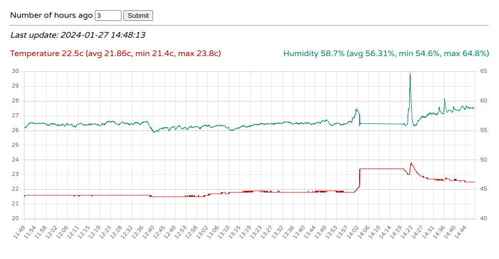

# RPi Gardener

Note: while I try to keep the main branch of this project in a working state,
this project is still very work in progress.

The goal of this project is to be able to monitor the environment, to ensure
its propice for growing plants.

You will find in this repository all necessarry files and scripts to read 
temperature and humidity data from a DHT22 sensor, wired to a Raspberry Pi 4 
Model B, as well as capacitative soil moisture sensors, wired to a Raspberry 
Pico board. 

It stores the results every 2 seconds in a local Sqlite database, and renders 
them on a bare simple frontend using ChartJS powered by Flask and web-sockets.
It also implements a simple notification service, and render the live readings
from both the RPi and the Pico on 128x64 OLED (SSD1306) displays.

Readings from the DHT22 happens directly from the RPi. But readings from the 
capacitative soil moisture sensors, are sent over HTTP from the Pico to the 
RPi.

## Requirements

Get and build Python 3.12 from source

    sudo apt update
    sudo apt install build-essential zlib1g-dev libncurses5-dev libgdbm-dev \
        libnss3-dev libssl-dev libreadline-dev libffi-dev libsqlite3-dev
    wget https://python.org/ftp/python/3.12.1/Python-3.12.1.tgz
    tar -xf Python-3.12.1.tgz 
    cd Python-3.12.1
    ./configure --enable-optimizations
    sudo make altinstall
    
Install `nginx`

    sudo apt install nginx

Install `screen` to run commands in the background and keep them persistant

    sudo apt install screen

Create a Python virtual environment and install the Python dependencies 
(this is a one-off command)

    make venv deps
    
Create an `.env` file at the root of the repository, and fill in the required
values. Ensure to keep this file secret, as it contains some sensitive values.

    # .env
    
    MAX_TEMPERATURE=25
    MIN_TEMPERATURE=18
    MAX_HUMIDITY=65
    MIN_HUMIDITY=40
    
    # flask secret key
    SECRET_KEY=a-random-secret-string
    
    # enables system notifications, set to 0 to disable
    ENABLE_NOTIFICATION_SERVICE=1 

    # if ENABLE_NOTIFICATION_SERVICE is set, the following values are 
    # required, else you can leave them empty.
    
    # Gmail account email sender
    GMAIL_SENDER='foo@example.com'
    # comma separated list of email recipients 
    GMAIL_RECIPIENTS='foo@example.com, bar@example.com'
    # Gmail username used for auth
    GMAIL_USERNAME='foo@example.com'
    # Gmail account password (obtained with Gmail app passwords)
    GMAIL_PASSWORD=''
    # subject title to use in email notifications
    GMAIL_SUBJECT='DHT-22 sensor alert!'

## Development

Run the dht sensor polling service
    
    make polling
    
From another terminal window, run the flask server

    make flask

You should be able to browse the app at <http://LOCAL-IP:5000/>
    
## Production(ish)

By production, I mean leaving the RPi running in the background on a
local (secure) home network for personal access. Please do not use these
configs for exposing your server to the Internet.

### Link files 

Link the app static files to `/var/www/html`

    sudo rm /var/www/html/*
    sudo ln -s "$(pwd)/rpi/static" /var/www/html
    
Link the Nginx configuration files

    sudo rm /etc/nginx/nginx.conf
    sudo ln -s "$(pwd)/nginx/nginx.conf" /etc/nginx/nginx.conf
    sudo ln -s "$(pwd)/nginx/sites-enabled/rpi.conf" /etc/nginx/sites-enabled/rpi.conf
    
### Background services
    
Use `screen` in order to keep the scripts persistant over the SSH session

Start with the polling service first
   
    screen -d -m make polling
    
Then start the Gunicorn server

    screen -d -m make server
    
You can use `screen -ls` to list the active screen sessions, and re-attach to
any session using `session -r <id>`, allowing you to tail logs, or kill 
sessions.

### Nginx

Lastly, start Nginx 

    sudo systemctl start nginx
    
You should be able to browse the app at <http://LOCAL-IP/>
