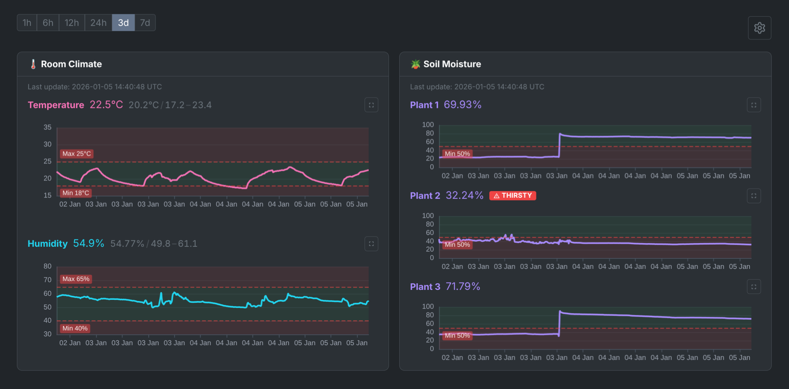
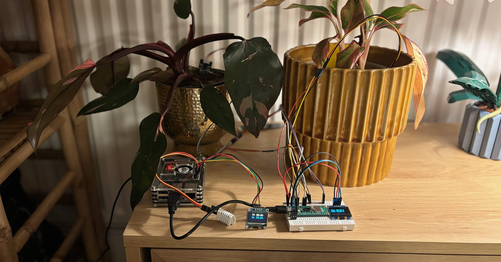
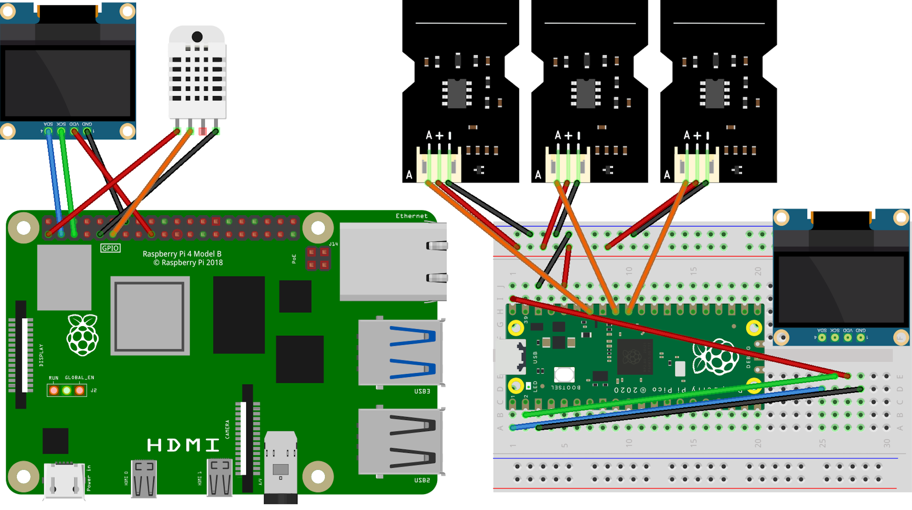

# RPi Gardener

Monitor your plant environment with a Raspberry Pi 4 and Raspberry Pi Pico.

Tracks temperature, humidity (DHT22 sensor), and soil moisture (capacitive
sensors) with a real-time web dashboard, OLED displays, and email alerts.




## Features

- Real-time temperature and humidity monitoring (DHT22)
- Soil moisture tracking for up to 3 plants (Pico + capacitive sensors)
- Web dashboard with live charts (Flask + WebSockets)
- 128x64 OLED displays on both RPi and Pico
- Email notifications when thresholds are crossed
- HTTPS with self-signed certificates
- Docker deployment

## Requirements

- Raspberry Pi 4 with Docker installed
- Raspberry Pi Pico W (for soil moisture sensors)
- DHT22 temperature/humidity sensor
- SSD1306 OLED display (128x64)
- Capacitive soil moisture sensors (v1.2)

## Quick Start

### 1. Enable I2C on the Raspberry Pi

    sudo raspi-config  # Interface Options -> I2C -> Enable
    sudo modprobe i2c-dev
    echo "i2c-dev" | sudo tee -a /etc/modules

### 2. Install Docker

    curl -fsSL https://get.docker.com | sudo sh
    sudo usermod -aG docker $USER
    # Log out and back in for group changes to take effect

### 3. Configure Environment

Create a `.env` file:

```sh
# Required
SECRET_KEY=your-random-secret-key-here

# SSL certificate (use your RPi's local IP)
CERT_IP=192.168.1.100

# Thresholds for alerts
MAX_TEMPERATURE=25
MIN_TEMPERATURE=18
MAX_HUMIDITY=65
MIN_HUMIDITY=40

# Email notifications (optional, set to 0 to disable)
ENABLE_NOTIFICATION_SERVICE=0
GMAIL_SENDER=
GMAIL_RECIPIENTS=
GMAIL_USERNAME=
GMAIL_PASSWORD=
GMAIL_SUBJECT=DHT-22 sensor alert!
```

### 4. Start Services

    make up

The dashboard will be available at `https://YOUR-RPI-IP/`

(Accept the self-signed certificate warning in your browser)

### 5. Set Up the Pico

See [pico/README.md](./pico/README.md) for Pico installation instructions.

## Commands

```bash
make up          # Start services
make down        # Stop services
make logs        # View all logs
make logs-app    # View app logs only
make restart     # Restart services
make clean       # Stop and remove volumes
make mprestart   # Restart Pico (if it loses sync)
```

## Pico API

The Pico sends moisture readings via HTTP POST:

    POST /pico
    Content-Type: application/json

    {
      "plant-1": 45.2,
      "plant-2": 67.8,
      "plant-3": 52.1
    }

Validation:
- `plant_id`: alphanumeric, hyphens, underscores (max 64 chars)
- `moisture`: number between 0-100 (percentage)

## Data Management

- Historical data older than 3 days is automatically deleted
- Database persisted in Docker volume `rpi-gardener-db`
- Regenerate SSL certs by removing volume: `docker volume rm rpi-gardener-certs`

## Troubleshooting

**Pico stops sending data**: The Pico can lose sync. Add a cron job to
restart it periodically:

    0 */3 * * * (cd /home/pi/rpi-gardener && make mprestart)

**Email notifications not working**: Ensure `GMAIL_PASSWORD` uses a
Gmail App Password (not your account password).

**Container won't start**: Check that I2C is enabled and devices exist:

    ls -la /dev/i2c-* /dev/gpiomem

## Security

This project is designed for local home networks:
- HTTPS with self-signed certificates
- No authentication on dashboard or API
- Do not expose to the internet without additional security

## Wiring


