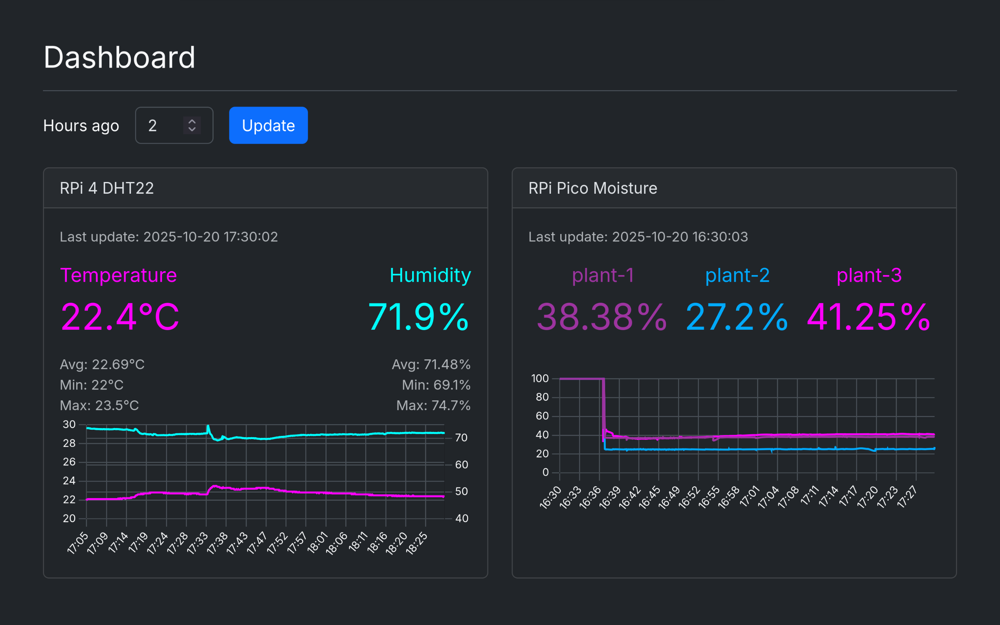

# RPi Gardener

Monitor your plant environment with a Raspberry Pi 4 and Raspberry Pi Pico.

Tracks temperature, humidity (DHT22 sensor), and soil moisture (capacitive
sensors) with a real-time web dashboard, OLED displays, and email alerts.




## Features

- Real-time temperature and humidity monitoring (DHT22)
- Soil moisture tracking for up to 3 plants (Pico + capacitive sensors)
- Modern web dashboard with live charts and threshold visualization
- Visual alerts when sensor values exceed configured thresholds
- Password-protected admin interface to manage settings
- 128x64 OLED displays on both RPi and Pico
- 16x2 LCD alert display with scrolling text
- Notifications when thresholds are crossed and when alerts resolve
- Smart plug automation (TP-Link Kasa) for humidity control
- Docker deployment

## Requirements

- Raspberry Pi 4 with Docker installed
- Raspberry Pi Pico (connected via USB for soil moisture sensors)
- DHT22 temperature/humidity sensor
- 2x SSD1306 OLED displays (128x64) - one for Pico, one optional for RPi
- 3x capacitive soil moisture sensors (v1.2)
- 1602A LCD with I2C backpack (optional, for alert display)
- TP-Link Kasa smart plug (optional, for automatic humidity control)

### Why both a Pico and a Raspberry Pi?

The Raspberry Pi 4 doesn't have analog-to-digital converter (ADC) inputs,
which are required to read capacitive soil moisture sensors. A common solution
is to add an external ADC module (like the ADS1115) to the RPi's I2C bus.
However, this project uses a Raspberry Pi Pico instead for several reasons:

- **Practical**: I already had a Pico lying around, so why not put it to use
- **More GPIO**: The Pico provides 3 ADC pins and 26 GPIO pins total, leaving
  plenty of room for additional sensors or peripherals without competing for
  the RPi's limited GPIO. Future additions like light sensors, water level
  sensors, or relay controls can be handled entirely by the Pico
- **Architectural separation**: Keeping sensor reading on a dedicated
  microcontroller isolates it from the main application. The Pico handles
  real-time ADC sampling and display updates, while the RPi focuses on the web
  server, database, and notifications. If the RPi application crashes or
  restarts, the Pico keeps running independently
- **Network scalability**: Using a Pico W instead of the standard Pico allows
  sensors to communicate over WiFi rather than USB serial. This enables a
  distributed setup where multiple Picos in different locations (greenhouse,
  garden beds, indoor plants) can all report back to a single RPi base station
  over the network

## Quick Start

### 1. Enable I2C on the Raspberry Pi

    sudo raspi-config  # Interface Options -> I2C -> Enable
    sudo modprobe i2c-dev
    echo "i2c-dev" | sudo tee -a /etc/modules

### 2. Install Docker

    sudo apt update
    sudo apt install -y docker.io docker-compose docker-compose-plugin
    sudo systemctl enable --now docker
    sudo usermod -aG docker $USER
    sudo reboot  # reboot pi

### 3. Configure Environment

Create a `.env` file:

```sh
# SSL certificate (use your RPi's local IP)
CERT_IP=192.168.1.100

# Admin password for the settings UI (optional)
# If set, enables the admin interface accessible via the gear icon
# Login with username "admin" and this password
ADMIN_PASSWORD=your_secure_password

# DHT22 thresholds (optional, these are defaults)
MAX_TEMPERATURE=25
MIN_TEMPERATURE=18
MAX_HUMIDITY=65
MIN_HUMIDITY=40

# Moisture thresholds (optional)
# Default for all plants
MIN_MOISTURE=30
MIN_MOISTURE_PLANT_1=25
MIN_MOISTURE_PLANT_2=30
MIN_MOISTURE_PLANT_3=35

# Notifications (optional, set to 1 to enable)
ENABLE_NOTIFICATION_SERVICE=0
# Backends: "gmail", "slack", or "gmail,slack" for both
NOTIFICATION_BACKENDS=gmail

# Gmail
GMAIL_SENDER=
GMAIL_RECIPIENTS=
GMAIL_USERNAME=
GMAIL_PASSWORD=

# Slack (create webhook at https://api.slack.com/messaging/webhooks)
SLACK_WEBHOOK_URL=

# Humidifier (optional, TP-Link Kasa smart plug)
# Automatically controls a humidifier based on humidity alerts
ENABLE_HUMIDIFIER=0
HUMIDIFIER_HOST=192.168.1.100  # IP address of your Kasa plug

# OLED display (optional, SSD1306 128x64)
# Shows temperature and humidity readings
ENABLE_OLED=0

# LCD 1602A alert display (optional)
# Shows active alerts with scrolling text
ENABLE_LCD=0
LCD_I2C_ADDRESS=0x27           # Use 0x3F if 0x27 doesn't work
LCD_SCROLL_DELAY_SEC=0.7       # Scroll speed (lower = faster)
```

### 4. Start Services

    make up

The dashboard will be available at `https://YOUR-RPI-IP/`

(Accept the self-signed certificate warning in your browser)

### 5. Set Up the Pico

See [pico/README.md](./pico/README.md) for Pico installation instructions.

## Commands

### Production (Raspberry Pi)

```bash
make up          # Start all services
make up-rebuild  # Rebuild (clears static volume for fresh FE)
make down        # Stop services
make logs        # View all logs
make logs-app    # View app container logs
make restart     # Restart services
make clean       # Stop and remove volumes
make mprestart   # Restart Pico script (if it loses sync)
```

### Development (local machine)

Run the dashboard locally without RPi hardware. The dev environment uses mock
sensors (`MOCK_SENSORS=1`) to generate realistic data without physical hardware.

```bash
cp .env.example .env   # Configure environment
make dev               # Start dev environment
make dev-seed          # Seed database with sample data
make dev-logs          # View logs
make dev-down          # Stop dev environment
make dev-rebuild       # Rebuild after frontend changes
```

The dev dashboard will be available at `http://localhost:5000/`

### Testing

```bash
make devdeps     # Install dev dependencies
make test        # Run test suite
make lint        # Run linters
```

## Pico Communication

The Pico sends moisture readings via USB serial as JSON, including raw ADC values for debugging:

    {"plant-1": {"pct": 45.2, "raw": 29550}, "plant-2": {"pct": 67.8, "raw": 25000}, ...}

The RPi reads from `/dev/ttyACM0` and persists readings directly to the database.

## Data Management

- Historical data is automatically deleted after the configured retention period (default: 7 days)
- Retention period can be changed via the admin interface
- Database persisted in Docker volume `rpi-gardener-db`
- Regenerate SSL certs by removing volume: `docker volume rm rpi-gardener-certs`

## Troubleshooting

**Pico stops sending data**: The Pico can lose sync. Add a cron job to
restart it periodically:

    0 */3 * * * (cd /home/pi/rpi-gardener && make mprestart)

**Email notifications not working**: Ensure `GMAIL_PASSWORD` uses a
Gmail App Password (not your account password).

**Container won't start**: Check that I2C is enabled and devices exist:

    ls -la /dev/i2c-* /dev/gpiochip0 /dev/gpiomem /dev/ttyACM*

**Pico on different serial port**: The app auto-detects `/dev/ttyACM0` or
`/dev/ttyACM1`. You can also set `PICO_SERIAL_PORT` in `.env` to specify
a custom port.

## Security

This project is designed for local home networks:
- HTTPS with self-signed certificates
- Dashboard is publicly accessible (read-only)
- Admin interface protected by HTTP Basic Auth (set `ADMIN_PASSWORD` to enable)
- Do not expose to the internet without additional security

## Wiring

### Raspberry Pi 4

| Component | Pin  | GPIO |
|-----------|------|------|
| DHT22     | DATA | 17   |
| OLED      | SDA  | 2    |
| OLED      | SCL  | 3    |
| LCD 1602A | SDA  | 2    |
| LCD 1602A | SCL  | 3    |

Note: OLED and LCD share the I2C bus (same SDA/SCL pins). They work together
because they have different I2C addresses (OLED: 0x3C, LCD: 0x27).
Run `i2cdetect -y 1` to verify both devices are detected.

### Raspberry Pi Pico

| Component | Pin    | GPIO |
|-----------|--------|------|
| OLED      | SDA    | 0    |
| OLED      | SCL    | 1    |
| Sensor 1  | AOUT   | 26   |
| Sensor 2  | AOUT   | 27   |
| Sensor 3  | AOUT   | 28   |


