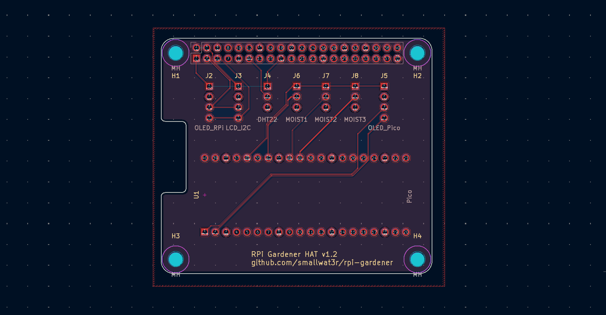
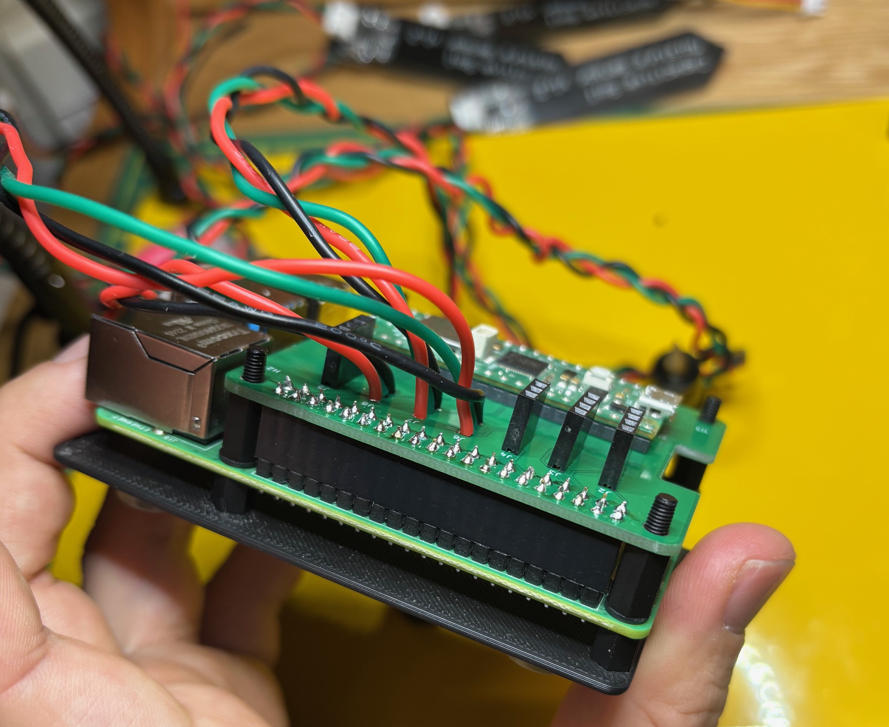
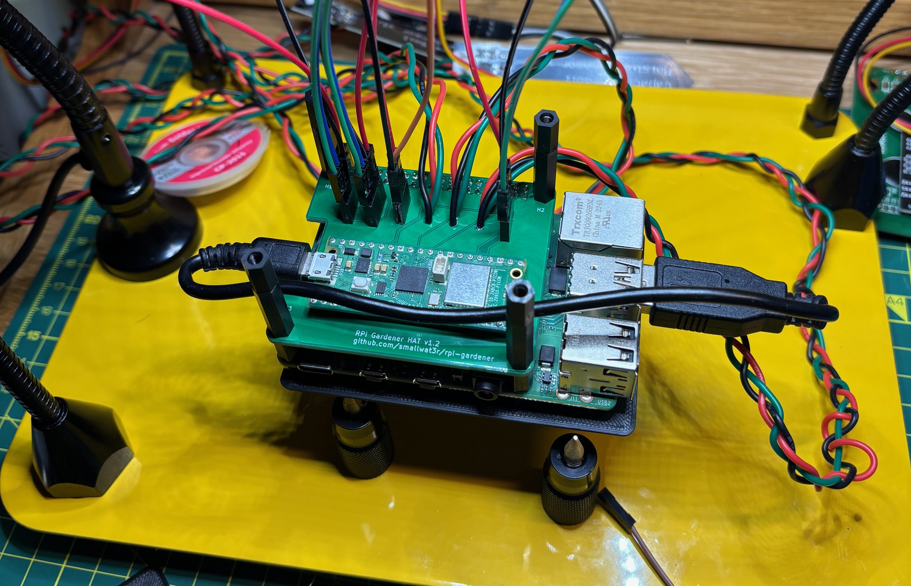
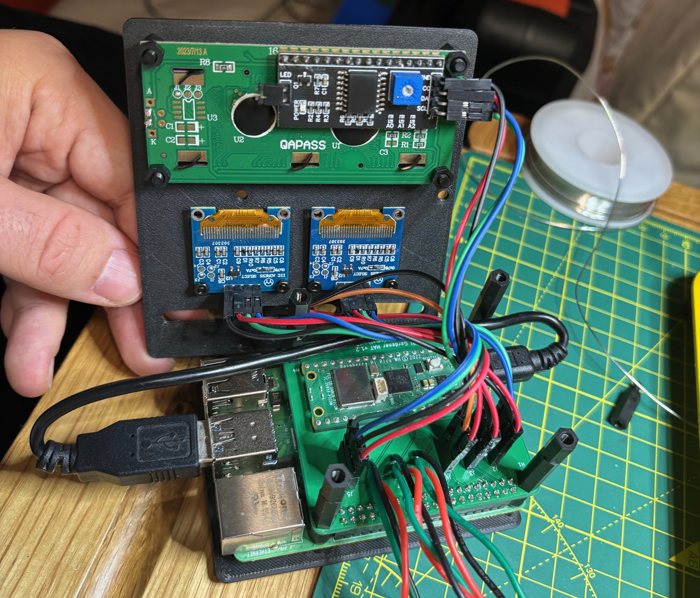

# RPi Gardener HAT

A custom PCB that combines a Raspberry Pi HAT with an integrated Raspberry Pi Pico for the RPi Gardener project.

## Contents

| Section | Description |
|---------|-------------|
| [PCB](#pcb) | Board specifications, components, pinouts, manufacturing |
| [Case](#case) | 3D printable base and display plates |
| [Assembly](#assembly) | Hardware requirements, stack diagram, build steps |
| [Troubleshooting](#troubleshooting) | Common issues and solutions |

---

## PCB Hat

### Overview

This PCB serves as a unified interface board that:
- Mounts directly on a Raspberry Pi as a HAT (Hardware Attached on Top)
- Integrates a Raspberry Pi Pico for analog sensor readings
- Provides connectors for all sensors and displays



### Board Specifications

| Property | Value |
|----------|-------|
| Dimensions | 65mm x 56mm (standard RPi HAT size) |
| Layers | 2 (F.Cu, B.Cu) |
| Thickness | 1.6mm |
| Mounting Holes | 4x M3 at standard HAT positions |
| Ground Planes | Both layers (unified GND net) |
| KiCad Version | 9.x |

### Components

#### Connectors

| Ref | Description | Pins | Connection |
|-----|-------------|------|------------|
| J1 | RPi GPIO Header | 2x20 | Raspberry Pi 40-pin GPIO |
| J2 | OLED Display (RPi) | 1x4 | I2C SSD1306 128x64 |
| J3 | LCD Display | 1x4 | I2C 1602A with PCF8574 |
| J4 | DHT22 Sensor | 1x3 | Temperature/Humidity |
| J5 | OLED Display (Pico) | 1x4 | I2C SSD1306 128x64 |
| J6 | Moisture Sensor 1 | 1x3 | Capacitive soil sensor |
| J7 | Moisture Sensor 2 | 1x3 | Capacitive soil sensor |
| J8 | Moisture Sensor 3 | 1x3 | Capacitive soil sensor |

#### Modules

| Ref | Description | Footprint |
|-----|-------------|-----------|
| U1 | Raspberry Pi Pico | Through-hole (40 pins) |

#### Mounting

| Ref | Description |
|-----|-------------|
| H1-H4 | M3 mounting holes at standard HAT positions |

### Pin Assignments

#### Raspberry Pi GPIO (directly from J1)

| Function | GPIO | Pin |
|----------|------|-----|
| I2C SDA | GPIO2 | 3 |
| I2C SCL | GPIO3 | 5 |
| DHT22 Data | GPIO17 | 11 |
| 3.3V Power | - | 1, 17 |
| 5V Power | - | 2, 4 |
| Ground | - | 6, 9, 14, 20, 25, 30, 34, 39 |

#### Raspberry Pi Pico (U1)

| Function | GPIO | Pin |
|----------|------|-----|
| OLED SDA | GP0 | 1 |
| OLED SCL | GP1 | 2 |
| Moisture 1 | GP26/ADC0 | 31 |
| Moisture 2 | GP27/ADC1 | 32 |
| Moisture 3 | GP28/ADC2 | 34 |
| 3.3V Out | 3V3 | 36 |
| Ground | GND | 3, 8, 13, 18, 23, 28, 33, 38 |

### Connector Pinouts

#### J2 - OLED RPi (SSD1306 I2C)
```
Pin 1: VCC (3.3V)
Pin 2: GND
Pin 3: SDA (GPIO2)
Pin 4: SCL (GPIO3)
```

#### J3 - LCD I2C (1602A with PCF8574)
```
Pin 1: VCC (5V)
Pin 2: GND
Pin 3: SDA (GPIO2)
Pin 4: SCL (GPIO3)
```

#### J4 - DHT22 Sensor
```
Pin 1: VCC (3.3V)
Pin 2: DATA (GPIO17)
Pin 3: GND
```

#### J5 - OLED Pico (SSD1306 I2C)
```
Pin 1: VCC (Pico 3.3V)
Pin 2: GND
Pin 3: SDA (GP0)
Pin 4: SCL (GP1)
```

#### J6, J7, J8 - Moisture Sensors
```
Pin 1: VCC (Pico 3.3V)
Pin 2: SIG (GP26/GP27/GP28)
Pin 3: GND
```

### I2C Bus Configuration

The board has two separate I2C buses:

#### RPi I2C Bus (GPIO2/GPIO3)
- OLED Display (J2) - typically address 0x3C
- LCD Display (J3) - typically address 0x27 or 0x3F

#### Pico I2C Bus (GP0/GP1)
- OLED Display (J5) - typically address 0x3C

### USB Passthrough

The Pico's USB port is accessible at the board edge for:
- Serial communication with the Raspberry Pi
- Firmware updates
- Debugging

Connect using a USB-A to Micro-USB cable from any RPi USB port to the Pico.

### Files

| File | Description |
|------|-------------|
| `kicad/rpi-gardener-hat.kicad_pro` | KiCad project file |
| `kicad/rpi-gardener-hat.kicad_sch` | Schematic |
| `kicad/rpi-gardener-hat.kicad_pcb` | PCB layout |
| `kicad/rpi-gardener-hat.pretty/` | Custom footprint library |
| `kicad/gerber.zip` | Manufacturing files (Gerber + drill) |

### Manufacturing

Upload `kicad/gerber.zip` to your preferred PCB manufacturer (JLCPCB, PCBWay, etc.).

Recommended settings:
- Layers: 2
- Thickness: 1.6mm
- Surface finish: HASL (lead free) or ENIG
- Copper weight: 1oz
- Solder mask: Any color
- Silkscreen: White

Design rules used:
- Min track width: 0.2mm
- Min clearance: 0.2mm
- Min via diameter: 0.6mm
- Min via drill: 0.3mm

---

## Case

3D printable base and display plates for mounting the full assembly.

### Files

| File | Description |
|------|-------------|
| `case/rpi-gardener-base.scad` | OpenSCAD source for base plate |
| `case/rpi-gardener-base.stl` | Base plate STL |
| `case/rpi-gardener-display-plate.scad` | OpenSCAD source for display plate |
| `case/rpi-gardener-display-plate.stl` | Display plate STL |

### Base Plate

| Property | Value |
|----------|-------|
| Dimensions | 90mm x 62mm x 1.5mm |
| Mounting Pattern | 58mm x 49.5mm (matches RPi/HAT) |
| Hole Diameter | 3.2mm (M3 clearance) |
| Features | Ventilation slots, USB cable cutout |

### Display Plate

| Property | Value |
|----------|-------|
| Dimensions | 90mm x 100mm x 1.5mm |
| OLED Cutouts | 2x 26mm x 15mm (for 0.96" SSD1306) |
| OLED Mount Spacing | 23mm x 23.5mm (M2) |
| LCD Cutout | 73mm x 25mm (for 1602A) |
| LCD Mount Spacing | 75mm x 31mm (M3) |
| Features | Cable routing slots, DHT22 holder tab |

### Printing Settings

- Layer height: 0.2mm
- Infill: 20%
- Material: PLA or PETG
- Supports: Not required

### Regenerating STL

```bash
cd case
openscad -o rpi-gardener-base.stl rpi-gardener-base.scad
openscad -o rpi-gardener-display-plate.stl rpi-gardener-display-plate.scad
```

### Customization

Edit the `.scad` files to adjust dimensions, enable/disable features, or change OLED type (0.96" vs 1.3").

---

## Assembly

### Required Hardware

#### Stack Hardware

| Item | Quantity | Notes |
|------|----------|-------|
| M3 screws | 4 | Bottom, thread into F-M spacers |
| M3 screws | 4 | Top, thread into F-F spacers |
| M3 spacers (5-6mm, F-M) | 4 | Between base and RPi |
| M3 washers (1mm) | 4 | Between RPi and next spacer |
| M3 spacers (10mm, F-M) | 4 | Between RPi and HAT |
| M3 spacers (20mm, F-M) | 4 | Above HAT |
| M3 spacers (5-6mm, F-F) | 4 | Top, screws thread into these |
| Rubber bumpons (8-10mm) | 4 | Anti-slip feet under base plate |

#### Display Mounting

| Item | Quantity | Notes |
|------|----------|-------|
| M2 screws (1mm) | 8 | To attach OLEDs to display plate |
| M2 nuts | 8 | To secure OLEDs |
| M3 screws | 4 | To attach LCD to display plate |
| M3 spacers (5-6mm, F-M) | 4 | Between display plate and LCD |
| M3 nuts | 4 | To secure LCD |
| M3 screw | 1 | Front, to mount DHT22 to display plate pole |
| M3 spacer (F-M) | 1 | Between DHT22 and display plate pole |
| M3 nut | 1 | Back, to secure DHT22 |

#### PCB Components

| Item | Quantity | Notes |
|------|----------|-------|
| 2x16 pin male-to-female header | 2 | For J1 (RPi GPIO), allows RPi plug/unplug |
| 1x4 pin male-to-female header | 3 | For J2, J5 (OLEDs) and J3 (LCD) |
| 1x3 pin male-to-female header | 1 | For J4 (DHT22) |
| Pin headers for Pico | 2x20 | Or solder Pico directly |
| Capacitive soil sensors | 3 | Solder directly to J6, J7, J8 |
| Small dupont wires (M-F) | - | Modules have male pins, HAT has female headers |

**Note:** The RPi 4 has native M2.5 mounting holes. You may need to lightly drill or ream them to fit M3 screws.

### Stack Diagram

```
    ┌─────────────────────┐
    │   4x M3 screws      │  ← Thread into F-F spacers
    ├─────────────────────┤
    │   Display plate     │  ← Top plate with OLEDs + LCD
    ├─────────────────────┤
    │   4x spacers 5-6mm  │  ← F-F (top screws thread here)
    │ + 4x spacers 20mm   │  ← F-M
    ├─────────────────────┤
    │   HAT (PCB)         │  ← RPi Gardener HAT with Pico
    ├─────────────────────┤
    │   4x spacers 10mm   │  ← F-M
    ├─────────────────────┤
    │   4x washers 1mm    │  ← Fine adjustment
    ├─────────────────────┤
    │   Raspberry Pi      │  ← RPi 4
    ├─────────────────────┤
    │   4x spacers 5-6mm  │  ← F-M
    ├─────────────────────┤
    │   Base plate        │  ← 3D printed base
    ├─────────────────────┤
    │   4x M3 screws      │  ← Thread into F-M spacers
    └─────────────────────┘
```

### Assembly Steps

1. **Solder Components to HAT**
   - Solder 2x 16-pin male-to-female headers for J1 (RPi GPIO)
   - Solder 1x4 pin male-to-female headers for J2, J5 (OLEDs) and J3 (LCD)
   - Solder 1x3 pin male-to-female header for J4 (DHT22)
   - Solder capacitive soil sensors directly to J6, J7, J8
   - Mount Pico: solder directly or use pin headers

2. **Mount Displays to Plate**
   - Attach OLEDs using 8x M2 screws (1mm) and 8x M2 nuts
   - Attach LCD using 4x M3 screws, 4x M3 spacers (5-6mm F-M), and 4x M3 nuts

3. **Build the Stack**
   - Insert 4x M3 screws from bottom through base plate into 4x 5-6mm F-M spacers
   - Place Raspberry Pi onto spacers
   - Add 4x 1mm washers
   - Add 4x 10mm F-M spacers
   - Mount HAT, seating GPIO connector onto RPi header
   - Add 4x 20mm F-M spacers
   - Add 4x 5-6mm F-F spacers

4. **Connect Peripherals**
   - Connect OLED displays to J2, J5 using dupont wires
   - Connect LCD 1602A to J3 using dupont wires
   - Connect DHT22 to J4 using dupont wires
   - Connect Pico USB to RPi USB port

5. **Secure Top Plate**
   - Place display plate on top
   - Secure with 4x M3 screws from top

6. **Mount DHT22 Sensor**
   - Attach DHT22 to display plate pole using M3 screw (front), M3 spacer F-M, and M3 nut (back)




